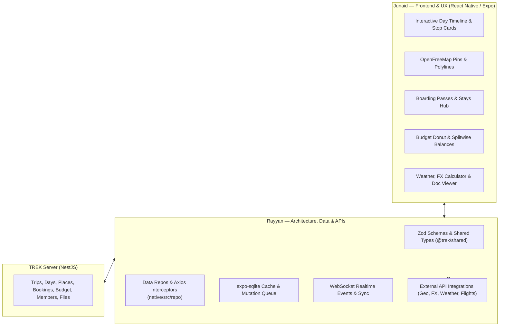

# TripTide: Native App Plan & Team Roadmap

A comprehensive product and technical roadmap for **TripTide** (React Native / Expo), splitting work between **Rayyan** (APIs, Architecture, Backend & Data Layer) and **Junaid** (Frontend, UI/UX, Interactions & Design).

---

## 1. High-Level Architecture & Responsibilities

### Core Division of Ownership

| Area | **Rayyan** (APIs, Architecture & Backend) | **Junaid** (Frontend, UI/UX & Interactions) |
| :--- | :--- | :--- |
| **Primary Domain** | Backend endpoints, external APIs, data contracts, state/repo layer, offline SQLite sync, WebSocket events. | React Native components, screen layouts, design system tokens, animations, bottom sheets, haptics, gesture handling. |
| **Guiding Focus** | *"How data flows, validates, stays offline-ready, and talks to the server/external services."* | *"How the app looks, feels, responds to touch, and delights the user on device."* |

---

## 2. Recommended External APIs

| Capability | Recommended Provider | Usage & Cost |
| :--- | :--- | :--- |
| **Maps & Tiles** | **OpenFreeMap / MapLibre** *(in repo)* | Completely free, no rate limits, vector tiles, privacy-focused. |
| **Place Search & Geocoding** | **Photon (Komoot) / Nominatim** or **Google Places API** | OpenStreetMap-based address & POI search (free). Optional Google Places for commercial ratings/photos. |
| **Routing & Distance** | **OSRM (Open Source Routing Machine)** or **GraphHopper** | Instant driving/walking distance and travel time badges between consecutive stops without high API costs. |
| **Weather Forecasts** | **Open-Meteo** | Free for non-commercial/standard use, no API key required, hourly & 7-day forecasts by lat/long. |
| **Exchange Rates** | **Frankfurter API** (ECB data) | Free, open-source daily currency conversion. Cache rates locally for instant offline math. |
| **Flight Tracking** | **AviationStack** or **AeroDataBox (RapidAPI)** | Lookup flight numbers (e.g. `BA117`) to auto-populate terminals, gates, departure times, and live delay status. |
| **Cover Photos** | **Unsplash API** *(in server)* | Curated high-resolution trip destination covers. |

---

## 3. Sprint-by-Sprint Work Division

### Sprint 1: Interactive Itinerary & Place Discovery

**Goal:** Turn the view-only itinerary into a full-featured planner with stop editing, search, and map routes.

#### **Rayyan (APIs & Data Layer)**
- [x] **Place Search & Geocoding Service:** Build a search client in `native/src/api/` using Photon/Nominatim with coordinate, address, and category parsing.
- [x] **Days & Stops Data Layer (`native/src/repo/`):** Implement full CRUD methods (`createDay`, `updateDay`, `deleteDay`, `addPlace`, `updatePlace`, `reorderPlaces`, `deletePlace`).
- [x] **Shared Contracts:** Ensure Zod schemas in `@trek/shared` cover time slots, arrival/departure fields, and coordinate validation.
- [x] **Route Distance & Duration Utility:** Integrate an OSRM routing endpoint/utility that calculates distance and travel time between consecutive stops.

#### **Junaid (Frontend & UI/UX)**
- [x] **Interactive Day Timeline:** Build vertical timeline cards featuring time pills, category badges, travel-time indicators between stops, and drag handles.
- [x] **Place Search Bottom Sheet:** Implement a modal search sheet with search debouncing, loading skeletons, recent searches, and result cards.
- [x] **Stop Editor Bottom Sheet:** Build form for editing stop title, scheduled time, notes, and a day-selector dropdown to transfer stops between days.
- [x] **Map Polyline & Pins:** Update the OpenFreeMap webview to plot numbered stop markers and draw route lines connecting the day's stops in order.

---

### Sprint 2: Bookings, Transit & Flights Hub

**Goal:** Build a unified travel wallet for flights, hotel stays, trains, and rental cars.

#### **Rayyan (APIs & Data Layer)**
- [x] **Bookings Data Model & Repo:** Implement `bookingsRepo.ts` to talk to `/api/reservations`, supporting stays, transit, activities, confirmation codes, and check-in/out times.
- [x] **Flight Lookup Service:** Create an API integration service to look up flight numbers and auto-fill departure/arrival airports, terminals, and scheduled times.
- [x] **Navigation Intent Utility:** Build a deep-link utility (`launchDirections(lat, lng, label)`) that prompts the user to open Apple Maps, Google Maps, Citymapper, or Waze.

#### **Junaid (Frontend & UI/UX)**
- [x] **Bookings Hub Screen:** Segmented tabs for `Stays`, `Flights & Transit`, and `Activities`.
- [x] **Travel Cards:** Design specialized cards (e.g., flight card styled like a boarding pass with departure/arrival airport codes; hotel card with dates and address).
- [x] **Add/Edit Booking Flow:** Bottom sheet form with system date/time pickers (`@react-native-community/datetimepicker`) and booking type selectors.
- [x] **One-Tap Actions:** Quick-copy button for PNR/confirmation codes (with visual toast/feedback) and "Open in Maps" button on stay locations.

---

### Sprint 3: Multi-Currency Budget & Expense Splitting

**Goal:** Provide full offline expense tracking, multi-currency conversion, and group debt balances.

#### **Rayyan (APIs & Data Layer)**
- [x] **FX Rate Sync & Offline Cache:** Integrate Frankfurter API with local storage caching so currency conversion functions without an internet connection.
- [x] **Budget Data Layer (`budgetRepo.ts`):** Build endpoints integration for adding, updating, and categorizing trip expenses.
- [x] **Debt Resolution Math Engine:** Write unit-tested utility to compute net balances among trip members (*Who paid vs. who owes what*).

#### **Junaid (Frontend & UI/UX)**
- [x] **Budget Dashboard:** Header displaying total spent vs budget, base currency switcher, and visual spending breakdown (progress bars or donut chart).
- [x] **"Who Owes Who" Balances Tab:** Clear member debt cards with green/red status pills (*"Rayyan owes Junaid £25"*).
- [x] **Quick Add Expense Sheet:** Custom numeric keypad, currency selector, and member multi-selector for splitting expenses (equal, custom, or percentage shares).

---

### Sprint 4: Smart Packing, Documents & File Attachments

**Goal:** Enable interactive packing checklists and an offline vault for tickets and vouchers.

#### **Rayyan (APIs & Data Layer)**
- [ ] **File Upload Pipeline:** Implement multipart upload in `native/src/api/` using `expo-document-picker` and `expo-image-picker` against `/api/files`.
- [ ] **Offline File Caching:** Cache downloaded PDF tickets, boarding passes, and images to local device storage.
- [ ] **Packing Repo & Optimistic Updates:** Build `packingRepo.ts` supporting category creation, item checklist toggling, and member assignments.

#### **Junaid (Frontend & UI/UX)**
- [ ] **Packing Checklist Screen:** Smooth animated checkboxes with tactile haptic feedback (`expo-haptics`) on toggle.
- [ ] **Progress Indicator & Filters:** Category progress indicators (e.g. *"5/8 packed"*) and quick filters for `Packed`, `Unpacked`, and `Assigned to me`.
- [ ] **Document & Attachment Vault:** Grid/list view of uploaded documents with file type icons, plus in-app full-screen preview for PDFs and photos.

---

### Sprint 5: Offline-First Engine, Live Collaboration & Utilities

**Goal:** Ensure the app works seamlessly in airplane mode and syncs live when internet is restored.

#### **Rayyan (APIs & Data Layer)**
- [ ] **Local SQLite Database (`native/src/db/`):** Set up local schema tables using `expo-sqlite` for trips, days, stops, bookings, and expenses.
- [ ] **Mutation Queue:** Intercept mutations when offline, generate temporary UUIDs, queue them, and replay idempotently with `X-Socket-Id` headers when reconnected.
- [ ] **WebSocket Realtime Listeners:** Connect native WebSocket to listen for server events and update local state when another collaborator edits the trip.

#### **Junaid (Frontend & UI/UX)**
- [ ] **Offline State Indicators:** Subtle offline status chip/banner and optimistic UI states (showing pending sync spinner when queuing offline edits).
- [ ] **Traveler Toolkit Screen:**
  - Destination weather card (live forecast via Open-Meteo).
  - Dual time zone clock (home time vs destination time).
  - Quick offline currency converter calculator.
- [ ] **Trip Collaborators & Invites:** Member avatar bubbles in header, invite modal by email/username, and collaborator role badges (Owner vs Editor).

---

## 4. Collaboration Workflow & Rules

1. **Contract-First Development:**
   - Rayyan defines the TypeScript interfaces and Zod schemas in `@trek/shared` or `native/src/types/` before implementation.
   - Junaid can immediately build against mock data matching the contract without waiting for backend endpoints.
2. **Branching Strategy:**
   - Use dedicated feature branches (e.g., `feat/itinerary-rayyan` and `feat/itinerary-ui-junaid`).
   - Keep file edits separated (`native/src/repo/*` & `native/src/api/*` for Rayyan; `native/src/screens/*` & `native/src/ui/*` for Junaid) to avoid merge conflicts.
3. **Parity & Testing:**
   - Run `npm run typecheck` and `npm run lint` in `native/` before merging.
   - Verify all write operations work seamlessly in the simulator.
